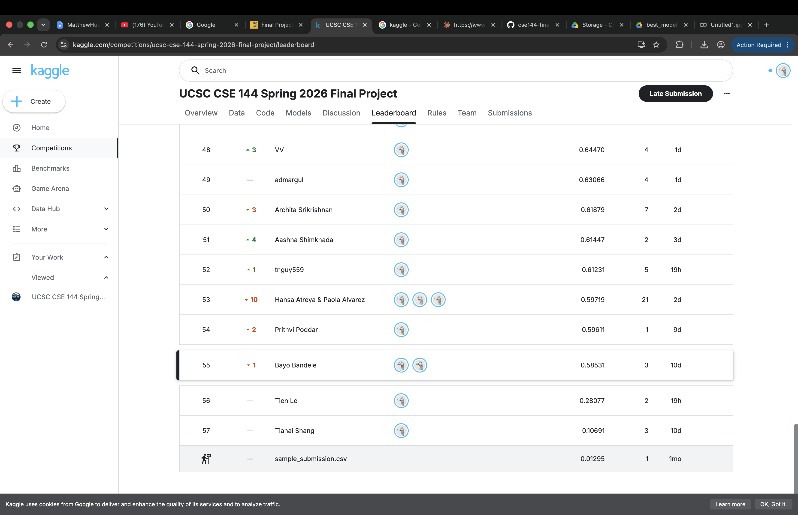
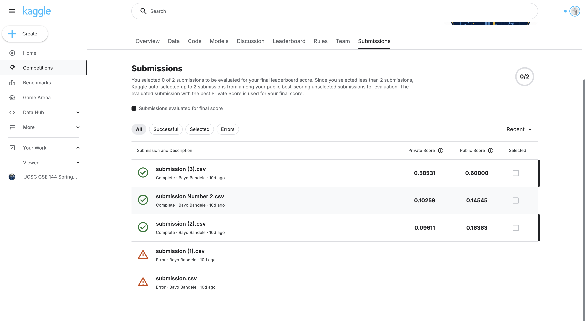

# CSE 144 Final Project — Transfer Learning Challenge

**Team:** Bayo Bandele (CruzID: 2141210), Hegen Chang (CruzID: 2164517)
**Course:** CSE 144, Spring 2026, UC Santa Cruz

## Overview

This project builds a 100-class image classifier using transfer learning. The dataset has only ~10 training images per class, so we fine-tuned a pretrained **EfficientNet-B2** (ImageNet weights) instead of training from scratch.

- **Validation Accuracy:** ~60%
- **Kaggle Public Score:** 0.60000 (Rank 30)

## Files

- `notebook.ipynb` — full training and inference pipeline
- `CSE144_Final_Report.pdf` — written project report
- `leaderboard.png` — screenshot of our Kaggle leaderboard position
- `submission.csv` — final Kaggle submission

## Model Weights

Trained model weights (`best_model.pth`) are available here:
[Download best_model.pth](https://drive.google.com/file/d/1zfCrme2KKJTZR8VzYS2gq3PWeFeR2icH/view?usp=sharing)

## How to Run

### 1. Setup
Open `notebook.ipynb` in Google Colab. Enable GPU via **Runtime → Change runtime type → T4 GPU**.

### 2. Get the Dataset
Download the dataset from the [Kaggle competition page](https://www.kaggle.com/competitions/ucsc-cse-144-spring-2026-final-project), upload the zip to Colab, and unzip it into a `data/` folder so you have `data/train/` and `data/test/`.

### 3. Train
Run all training cells in order. This will:
- Build the dataset with correct numeric label ordering (folders `0`–`99` → labels `0`–`99`)
- Fine-tune EfficientNet-B2 for 20 epochs
- Save the best checkpoint as `best_model.pth`

Training takes ~5–10 minutes on a T4 GPU.

### 4. Generate Predictions
Run the inference cell. This loads `best_model.pth`, runs predictions on all 1,036 test images, and writes `submission.csv` in the format Kaggle expects.

### 5. Submit to Kaggle
Upload `submission.csv` to the [Kaggle competition](https://www.kaggle.com/competitions/ucsc-cse-144-spring-2026-final-project) under "Submit Predictions."

## Reproducibility

- Random seed: `42` (used for `random`, `numpy`, `torch`, `cuda`)
- Train/val split: 80/20, seed 42
- Environment: Google Colab, T4 GPU, Python 3.10, PyTorch + TorchVision

## Kaggle Leaderboard

See the full report (`CSE144_Final_Report.pdf`) for details.
